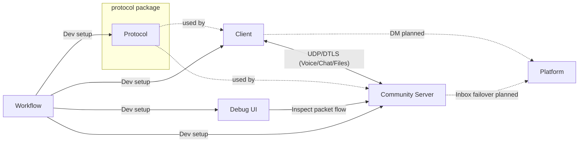
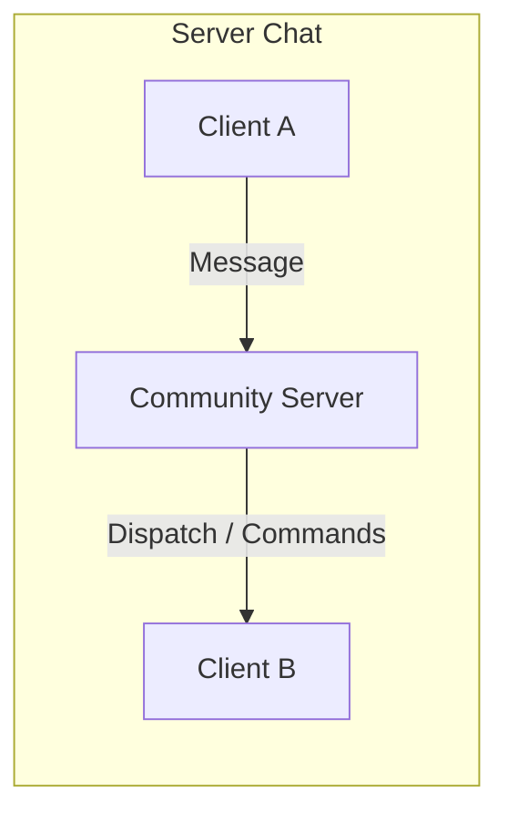
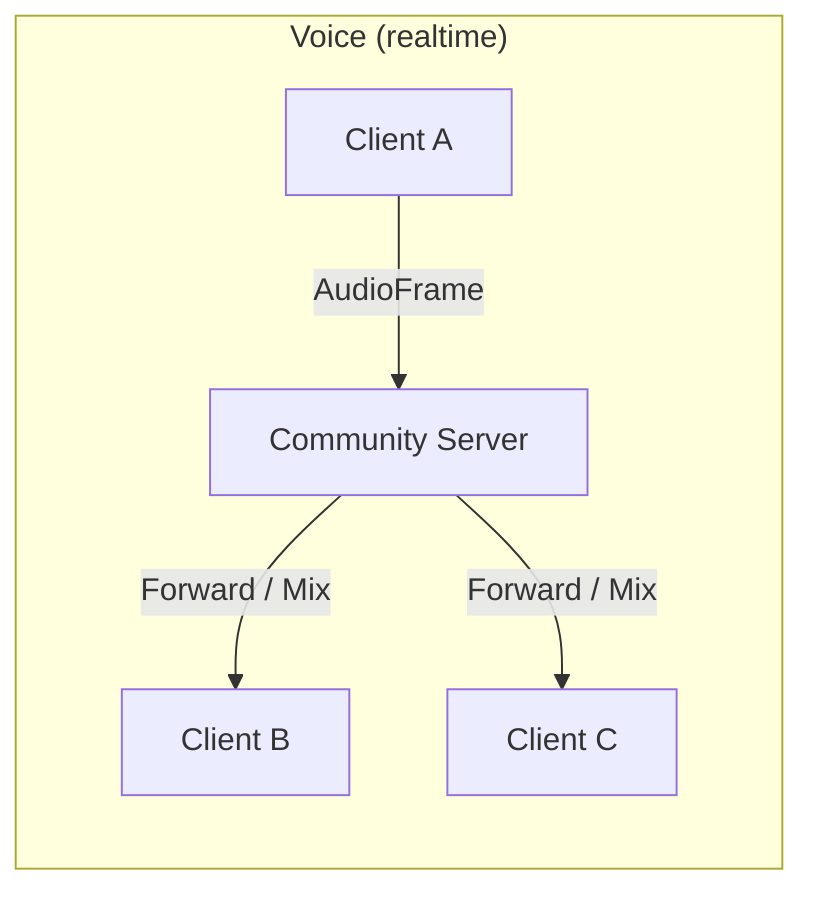
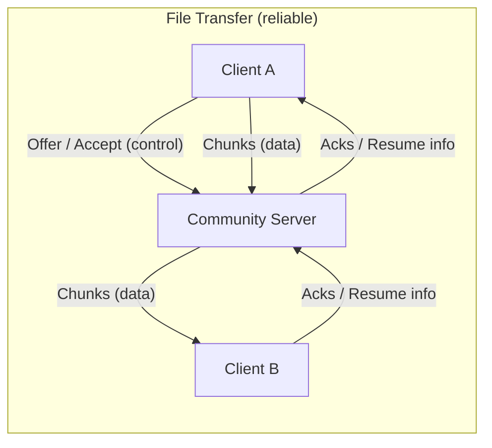
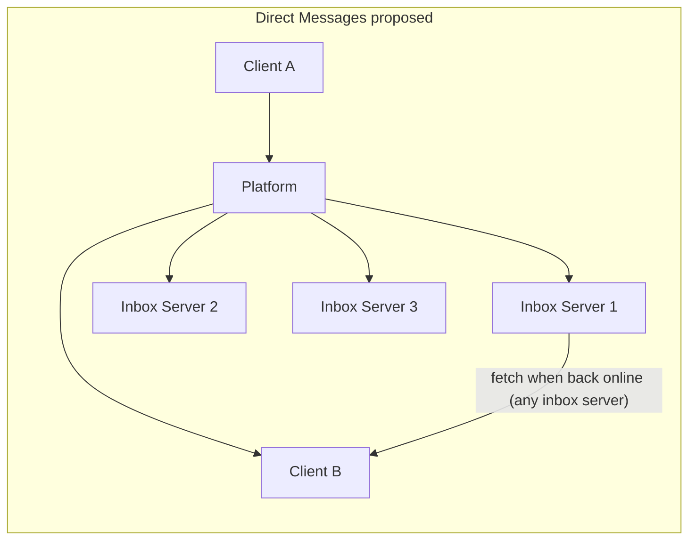
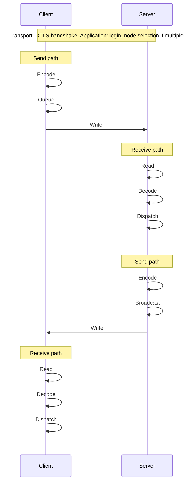

# AuraSpeak – Architecture

**Status:** Pre-alpha · **Last updated:** 2026-01-28 · **Stability:** Breaking changes expected

---

## Introduction

AuraSpeak is an alternative to Discord and Teamspeak. Security, openness, and low cost are the main goals; the project is intended to stay free after release. Decentralisation and security through encryption are central.

This document describes the technical architecture and components of AuraSpeak. The stack is split into: **transport layer** (UDP/DTLS), **application protocol** (AuraSpeak Protocol: framing, packet types), and **features** (Chat, Voice, File Transfer, Commands, DMs). For project overview and quickstart, see the [README](../README.md).

> **Current scope (implemented today):**
> The only end-to-end packet currently implemented is **DebugHello**: the client can send `DebugHello` to the Community Server, and the server can successfully decode and handle it. All other feature flows (chat, commands beyond basic disconnect, DMs/platform integration) are not implemented yet and are described as planned direction.

---

## System Overview

The architecture comprises existing components (Client, Community Server, Protocol, Debug UI, Workflow) and the planned Platform for user and key management and direct messages. Client and Server use **UDP/DTLS** as transport; the **AuraSpeak Protocol** (framing, packet types) runs on top; application **features** are Chat, Voice, File Transfer, Commands, and (planned) DMs. The Debug UI supports development; Workflow manages the dev environment.

Protocol is a **library/package** linked into Client and Server, not a deployable service. The diagram below shows it in a subgraph so it reads as an artifact, not a runtime.

*Solid lines: existing. Dashed: planned / used-by. Client–Server link is transport (UDP/DTLS); Protocol is a library linked into Client and Server.*

---

## Layers

### Transport layer

**UDP/DTLS.** All client–server and (planned) client–platform traffic uses DTLS over UDP. The transport layer provides encrypted datagrams only; no application semantics (no “Chat” or “DM” here).

### Application protocol

**AuraSpeak Protocol.** Framing, packet types, encode/decode. Defined and implemented in the [Protocol](https://github.com/AuraSpeak/protocol) repo. Carries feature payloads (Chat messages, Voice frames, File Transfer chunks, Commands, and when implemented DM-related data). Connection setup (e.g. login, node selection) is part of the application protocol, not the transport.

### Features

Application-level capabilities built on the AuraSpeak Protocol:

* **Chat (planned):** Server-authoritative dispatch and broadcast of messages; clients send to server, server forwards to appropriate clients.
* **Voice (planned):** Low-latency audio streaming for channels and/or groups. Clients send encrypted audio frames; the server forwards them to relevant peers (and can optionally mix or apply attenuation rules). Includes jitter buffering, packet-loss concealment, and (optionally) positional audio metadata.
* **File Transfer (planned):** Secure file sharing via chunked transfer with integrity checks and resumable downloads. Control-plane messages negotiate metadata and permissions; data-plane transfers use reliable delivery semantics (retries/acks) over the protocol and can be relayed via Community Servers (and/or stored in the DM inbox model when recipients are offline).
* **Commands (partly planned):** Server → client commands (e.g. ClientNeedsDisconnect exists; broader command set planned).
* **DMs (planned):** Direct messages via Platform, inbox on Community Servers, fetch from inbox when client is back online.

---

## Components

Repo links use `https://github.com/AuraSpeak/<repo>` (org **AuraSpeak**, repo names **client**, **server**, **protocol**, **debug-ui**, **workflow**, **platform**).

### Existing Components

| Component    | Repo                                                        | Role                                                                                                                                                        |
| ------------ | ----------------------------------------------------------- | ----------------------------------------------------------------------------------------------------------------------------------------------------------- |
| **Client**   | [AuraSpeak/client](https://github.com/AuraSpeak/client)     | Client code for AuraSpeak. Highly decoupled – can be tested in isolation in the UI Compile or loaded in the Debug UI. Supports multiple nodes per instance. |
| **Server**   | [AuraSpeak/server](https://github.com/AuraSpeak/server)     | Community server code. Authoritative for packet handling and (later) chat: dispatches packets and sends commands to clients.                                |
| **Protocol** | [AuraSpeak/protocol](https://github.com/AuraSpeak/protocol) | Application protocol (framing, packet types) for AuraSpeak. Transport is UDP/DTLS. Contains protocol definition and implementation.                         |
| **Debug UI** | [AuraSpeak/debug-ui](https://github.com/AuraSpeak/debug-ui) | Web interface for inspecting packet flow; evolves with the project to show how packets are routed on the server. Go backend, Vue frontend.                  |
| **Workflow** | [AuraSpeak/workflow](https://github.com/AuraSpeak/workflow) | Setup and management of the development environment.                                                                                                        |

### Planned Components

| Component    | Repo                                                        | Role                                              |
| ------------ | ----------------------------------------------------------- | ------------------------------------------------- |
| **Platform** | [AuraSpeak/platform](https://github.com/AuraSpeak/platform) | User and key management, hub for direct messages. |

---

## Feature-level communication

The following describes application **features** (Chat, Voice, File Transfer, Commands, DMs). All run over the AuraSpeak Protocol on UDP/DTLS.

### Server Chat (planned)

Chat runs via the Community Server: clients send messages to the server, which dispatches them authoritatively and forwards them to the appropriate clients. The server also sends commands to clients.

### Voice (planned)

Voice is real-time media: **low latency over best-effort delivery**. Clients send short, encrypted audio frames (e.g. Opus-encoded) to the Community Server, which forwards them to the peers in the same voice context (channel / group). The server can stay “dumb” (forward only) or evolve into a **mixer** (mixing, attenuation rules, per-user volume, positional audio) without changing the transport layer.

**Protocol expectations (directional):**
- Unreliable / time-sensitive frames (late frames are dropped rather than retried).
- Client-side jitter buffer + packet-loss concealment.
- Optional metadata: speaking state, stream id, positional/attenuation hints.

### File Transfer (planned)

File transfer is **reliable, integrity-checked, and resumable**. A small control-plane exchange negotiates metadata (name, size, hashes), permissions, and (optional) rate limits. The data plane sends chunks with sequence numbers and acknowledgements; transfers can resume from the last verified chunk. For recipients who are offline, the system can reuse the **inbox/storage concepts** (Platform + Community Servers) to hold encrypted payloads until fetched.

**Protocol expectations (directional):**
- Chunked payloads with per-chunk authentication/integrity (hash or MAC) plus an overall file digest.
- Flow control (windowing) and rate limiting to protect the server and clients.
- Resume tokens / checkpoints to continue after disconnects.

### Direct Messages and Inbox (Design Proposal)

**Concept.** Direct messages flow via the Platform: Client → Platform → target user. Messages are stored encrypted in the recipients’ inboxes. Inboxes are hosted on three Community Servers (failover). If a recipient is offline, incoming DMs stay in their inbox; when the client is back online, it pulls messages from one of the inbox servers that holds its inbox. A dedicated graveyard server for old messages is under consideration to bound inbox size and offload storage from the community servers.

**Proposed flow.** Platform receives DMs from senders and writes them to the recipient’s inbox on the assigned Community Server(s). When an inbox server is unavailable for some time, another server takes over the inbox role and the remaining servers replicate messages into the new inbox. The concrete replication model, failure detection, and placement rules are still to be defined (see TBD below).

*When back online, the client fetches its messages from one of the inbox servers.*

**Open Questions / Assumptions (TBD)**

* **Replication model:** How many replicas, sync vs async, consistency guarantees, and who coordinates replication when an inbox server takes over.
* **Failure detection / leases:** How and when an inbox server is considered down; whether leases or heartbeats are used; who decides failover and on what timeout.
* **Inbox placement:** How the Platform chooses which Community Server(s) host a user’s inbox; whether placement is static or can change over time.
* **Threat model / metadata:** What attackers are in scope; what metadata (e.g. who messaged whom, when) is visible to Platform or inbox servers and how it is limited or documented.

---

## Data Flow: Client ↔ Community Server

Data flow uses the **transport layer** (UDP/DTLS) for the connection and the **AuraSpeak Protocol** for framing and packet handling. The high-level flow is stable; concrete types and names are described in *Current implementation notes (v0.x)*.

### High-level flow

Connection setup: DTLS handshake (transport), then login (to be refined when the [Platform](https://github.com/AuraSpeak/platform) repo is started) and – when multiple nodes are available – selection of a node (application protocol). After that, send and receive follow the same pattern on both sides:

* **Send path:** Encode (packet → bytes) → Queue (optional) → Write (bytes onto transport).
* **Receive path:** Read (bytes from transport) → Decode (bytes → packet) → Dispatch (packet to handler).

The Client uses a queue and a send loop on the send path; the Server encodes and writes directly to each connection (no queue). On receive, both sides read, decode, and dispatch to a packet router or handler.

### Current implementation notes (v0.1)

The following describes how the high-level flow is implemented today. Variable names, types, and wiring are version-specific and may change.

| Path               | Implementation                                                                                                   |
| ------------------ | ---------------------------------------------------------------------------------------------------------------- |
| **Client Send**    | Packet → `Encode()` → `Send(enc)` → `sendCh` → `sendLoop` → `conn.Write(enc)`.                                   |
| **Server Receive** | `conn.Read(buf)` → raw bytes → `protocol.Decode(raw)` → packet → `router.HandlePacket(packet, addr)`.            |
| **Server Send**    | Packet → `Encode()` → `Broadcast(pkg)` → iterate connections → `conn.Write(enc)`. No queue, no send loop.        |
| **Client Receive** | `conn.Read(buf)` → raw → `Decode(raw)` → packet → `packetRouter.HandlePacket(packet)`. No channel, no send loop. |

**Concrete types (Go):** `protocol.Packet`, `protocol.Decode` / `Encode`; server uses `nm.router`, client uses `packetRouter`; server iterates with `conns.Range`.

### Client / Platform

*Coming soon.* DM and user/key management via the Platform.

### Server / Platform

*Coming soon.* Community Server ↔ Platform integration (e.g. inbox failover, replication).

---

## Error Handling

| Topic                   | Description                                                        | Owner            | Outcome                                              | Severity                                   |
| ----------------------- | ------------------------------------------------------------------ | ---------------- | ---------------------------------------------------- | ------------------------------------------ |
| unknown Packet          | Unknown or unsupported packet type after decode                    | client, server   | drop, log+metric                                     | warn                                       |
| Reliable packet wrong   | Invalid reliable sequence or payload (protocol semantics violated) | protocol         | drop; disconnect if repeated (TBD)                   | warn                                       |
| Packet loss on reliable | Missing or overdue reliable packet                                 | protocol, client | retry (resend / ack); log+metric if persistent (TBD) | info                                       |
| decode error            | Framing or decode failure (corrupt or malformed bytes)             | protocol         | drop, log+metric                                     | warn                                       |
| Disconnect / timeout    | Connection closed or idle timeout                                  | client, server   | disconnect                                           | info (graceful), warn (unexpected timeout) |
| voice late frame        | Voice frame arrives too late for playout (jitter buffer miss)                     | client           | drop frame; apply PLC; log+metric                    | info                                       |
| file checksum mismatch  | Chunk or file digest mismatch during file transfer                                | protocol, client | request resend; abort transfer if repeated (TBD)     | warn                                       |
| file transfer interrupt | Transfer interrupted by disconnect/timeout                                         | client           | resume from last verified chunk; retry with backoff  | info                                       |

**Owner:** Who defines or applies the handling: *protocol* (library reports/classifies), *client* / *server* (runtime handles). **Outcome:** drop = discard and do not process; disconnect = close connection; retry = resend or request again; log+metric = record and optionally expose for monitoring. **Severity:** debug / info / warn / error for logging and alerting.

**IMPORTANT:** Error handling will be refined and extended as the project evolves. Entries marked (TBD) are not yet decided.

---

## Appendix: Special Packets and Open Points

### Special Packets

* **ClientNeedsDisconnect:** Server-to-client command to disconnect. Triggers a disconnect on the client; the client sends a disconnect signal to the server.
* **VoiceFrame (planned):** Client-to-server and server-to-client realtime audio frame packet (low latency, drop-if-late).
* **VoiceState (planned):** Speaking state / stream negotiation updates (e.g. start/stop, stream id, optional positional data).
* **FileOffer / FileAccept (planned):** Control-plane handshake for starting a file transfer (metadata, permissions).
* **FileChunk / FileAck (planned):** Chunked data packets plus acknowledgements / resume checkpoints.
* **FileCancel (planned):** Cancel/abort an in-progress file transfer.
